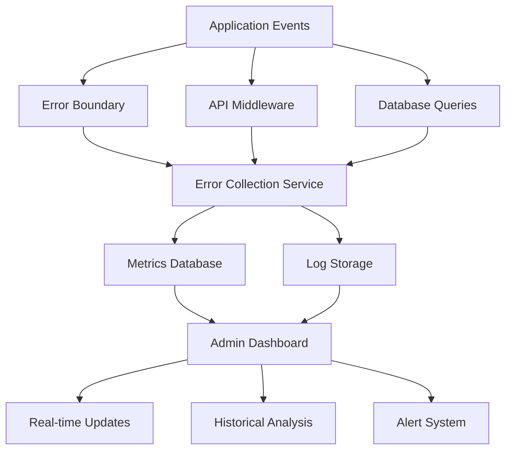
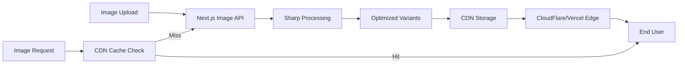
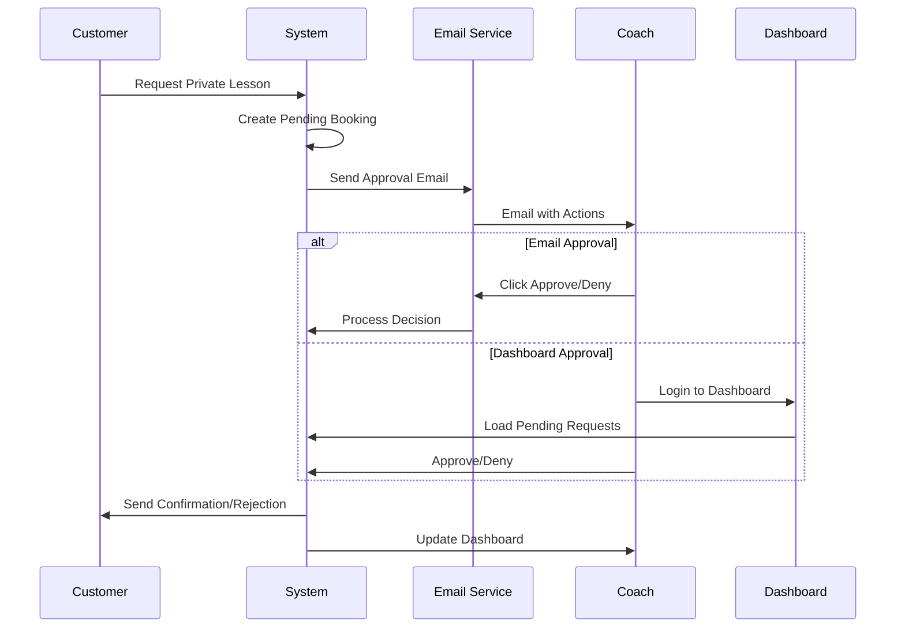

# Feature Implementation Strategy - Spirit Athletics

## Executive Summary

This document outlines the implementation strategy for three critical system enhancements:
1. **Performance Monitoring & Error Tracking Dashboard**
2. **Image Optimization & CDN Integration**
3. **Private Lesson Approval Workflow**

Each feature has been designed to integrate seamlessly with the existing architecture while maintaining scalability and performance.

---

## 📊 Feature 1: Performance Monitoring & Error Tracking Dashboard

### **Objective**
Create a comprehensive monitoring dashboard accessible to ADMIN users that displays system performance metrics, error logs, and health indicators in real-time.

### **Architecture Overview**



### **Implementation Strategy**

#### **Phase 1: Infrastructure Setup (Week 1)**

**1.1 Create Monitoring Database Schema**
```prisma
model SystemMetric {
  id          String   @id @default(cuid())
  type        MetricType
  name        String
  value       Float
  metadata    Json?
  timestamp   DateTime @default(now())
  
  @@index([type, timestamp])
  @@index([name, timestamp])
}

model ErrorLog {
  id          String   @id @default(cuid())
  level       ErrorLevel
  message     String
  stack       String?
  context     Json?
  userId      String?
  url         String?
  userAgent   String?
  timestamp   DateTime @default(now())
  resolved    Boolean  @default(false)
  resolvedAt  DateTime?
  resolvedBy  String?
  
  @@index([level, timestamp])
  @@index([resolved, timestamp])
}

model PerformanceLog {
  id          String   @id @default(cuid())
  route       String
  method      String
  statusCode  Int
  duration    Int      // milliseconds
  timestamp   DateTime @default(now())
  
  @@index([route, timestamp])
  @@index([duration])
}

enum MetricType {
  API_LATENCY
  DATABASE_QUERY
  MEMORY_USAGE
  CACHE_HIT_RATE
  BOOKING_RATE
  ERROR_RATE
}

enum ErrorLevel {
  DEBUG
  INFO
  WARNING
  ERROR
  CRITICAL
}
```

**1.2 Create Monitoring Service**
```typescript
// src/lib/monitoring/index.ts
class MonitoringService {
  private static instance: MonitoringService;
  private metricsQueue: Metric[] = [];
  private flushInterval: NodeJS.Timeout;

  static getInstance() {
    if (!this.instance) {
      this.instance = new MonitoringService();
    }
    return this.instance;
  }

  constructor() {
    // Flush metrics every 10 seconds
    this.flushInterval = setInterval(() => {
      this.flushMetrics();
    }, 10000);
  }

  async trackMetric(metric: Metric) {
    this.metricsQueue.push(metric);
    
    // Immediate flush for critical errors
    if (metric.type === 'ERROR' && metric.level === 'CRITICAL') {
      await this.flushMetrics();
    }
  }

  async trackAPICall(req: NextRequest, res: NextResponse, duration: number) {
    await prisma.performanceLog.create({
      data: {
        route: req.nextUrl.pathname,
        method: req.method,
        statusCode: res.status,
        duration,
      }
    });
  }

  async trackError(error: Error, context?: any) {
    await prisma.errorLog.create({
      data: {
        level: 'ERROR',
        message: error.message,
        stack: error.stack,
        context,
      }
    });
  }

  private async flushMetrics() {
    if (this.metricsQueue.length === 0) return;
    
    const metrics = [...this.metricsQueue];
    this.metricsQueue = [];
    
    try {
      await prisma.systemMetric.createMany({
        data: metrics
      });
    } catch (error) {
      console.error('Failed to flush metrics:', error);
    }
  }
}
```

**1.3 Implement Global Error Boundary**
```typescript
// src/components/ErrorBoundary.tsx
'use client';

import { Component, ReactNode } from 'react';
import { trackError } from '@/lib/monitoring';

interface Props {
  children: ReactNode;
  fallback?: ReactNode;
}

interface State {
  hasError: boolean;
  error?: Error;
}

export class ErrorBoundary extends Component<Props, State> {
  constructor(props: Props) {
    super(props);
    this.state = { hasError: false };
  }

  static getDerivedStateFromError(error: Error): State {
    return { hasError: true, error };
  }

  componentDidCatch(error: Error, errorInfo: any) {
    // Log to monitoring service
    trackError(error, {
      componentStack: errorInfo.componentStack,
      url: window.location.href,
      userAgent: navigator.userAgent,
    });
  }

  render() {
    if (this.state.hasError) {
      return this.props.fallback || (
        <div className="error-boundary-fallback">
          <h2>Something went wrong</h2>
          <details>
            <summary>Error details</summary>
            <pre>{this.state.error?.message}</pre>
          </details>
        </div>
      );
    }

    return this.props.children;
  }
}
```

#### **Phase 2: Middleware Integration (Week 1-2)**

**2.1 Enhanced API Middleware**
```typescript
// src/middleware.ts (enhanced)
import { MonitoringService } from '@/lib/monitoring';

export async function middleware(request: NextRequest) {
  const startTime = Date.now();
  const monitoring = MonitoringService.getInstance();
  
  // Existing security headers...
  
  // Add request tracking
  const response = NextResponse.next();
  
  // Track API performance
  if (request.nextUrl.pathname.startsWith('/api/')) {
    const duration = Date.now() - startTime;
    
    // Track slow requests
    if (duration > 1000) {
      await monitoring.trackMetric({
        type: 'API_LATENCY',
        name: request.nextUrl.pathname,
        value: duration,
        metadata: {
          method: request.method,
          slow: true
        }
      });
    }
    
    // Track all API calls
    response.headers.set('X-Response-Time', `${duration}ms`);
    
    // Log to performance database
    queueMicrotask(() => {
      monitoring.trackAPICall(request, response, duration);
    });
  }
  
  return response;
}
```

**2.2 Database Query Monitoring**
```typescript
// src/lib/prisma.ts (enhanced)
import { PrismaClient } from '@prisma/client';
import { MonitoringService } from '@/lib/monitoring';

const prismaClientSingleton = () => {
  return new PrismaClient({
    log: [
      {
        emit: 'event',
        level: 'query',
      },
      {
        emit: 'event',
        level: 'error',
      },
      {
        emit: 'event',
        level: 'warn',
      },
    ],
  });
};

const prisma = globalForPrisma.prisma ?? prismaClientSingleton();

// Monitor query performance
prisma.$on('query', async (e) => {
  const monitoring = MonitoringService.getInstance();
  
  if (e.duration > 100) { // Log slow queries > 100ms
    await monitoring.trackMetric({
      type: 'DATABASE_QUERY',
      name: 'slow_query',
      value: e.duration,
      metadata: {
        query: e.query,
        params: e.params,
        target: e.target
      }
    });
  }
});

// Monitor errors
prisma.$on('error', async (e) => {
  const monitoring = MonitoringService.getInstance();
  await monitoring.trackError(new Error(e.message), {
    target: e.target,
    timestamp: e.timestamp
  });
});
```

#### **Phase 3: Admin Dashboard UI (Week 2)**

**3.1 Dashboard Layout**
```typescript
// src/app/(dashboard)/dashboard/monitoring/page.tsx
import { getServerSession } from 'next-auth';
import { authOptions } from '@/lib/auth';
import { redirect } from 'next/navigation';
import MonitoringDashboard from './MonitoringDashboard';

export default async function MonitoringPage() {
  const session = await getServerSession(authOptions);
  
  // Restrict to ADMIN only
  if (!session || session.user.role !== 'ADMIN') {
    redirect('/dashboard');
  }
  
  return <MonitoringDashboard />;
}
```

**3.2 Dashboard Components**
```typescript
// src/app/(dashboard)/dashboard/monitoring/MonitoringDashboard.tsx
'use client';

import { useState, useEffect } from 'react';
import { 
  MetricsOverview, 
  ErrorLogViewer, 
  PerformanceChart,
  SystemHealth,
  AlertsPanel 
} from './components';

export default function MonitoringDashboard() {
  const [timeRange, setTimeRange] = useState('1h');
  const [metrics, setMetrics] = useState(null);
  const [errors, setErrors] = useState([]);
  const [autoRefresh, setAutoRefresh] = useState(true);

  useEffect(() => {
    const fetchData = async () => {
      const [metricsRes, errorsRes] = await Promise.all([
        fetch(`/api/admin/monitoring/metrics?range=${timeRange}`),
        fetch(`/api/admin/monitoring/errors?range=${timeRange}`)
      ]);
      
      setMetrics(await metricsRes.json());
      setErrors(await errorsRes.json());
    };

    fetchData();
    
    if (autoRefresh) {
      const interval = setInterval(fetchData, 30000); // Refresh every 30s
      return () => clearInterval(interval);
    }
  }, [timeRange, autoRefresh]);

  return (
    <div className="p-6 space-y-6">
      <div className="flex justify-between items-center">
        <h1 className="text-2xl font-bold">System Monitoring</h1>
        <div className="flex gap-4">
          <TimeRangeSelector value={timeRange} onChange={setTimeRange} />
          <AutoRefreshToggle value={autoRefresh} onChange={setAutoRefresh} />
        </div>
      </div>

      {/* System Health Overview */}
      <SystemHealth />

      {/* Key Metrics Grid */}
      <div className="grid grid-cols-1 md:grid-cols-2 lg:grid-cols-4 gap-4">
        <MetricCard title="API Latency" value={metrics?.avgLatency} unit="ms" />
        <MetricCard title="Error Rate" value={metrics?.errorRate} unit="%" />
        <MetricCard title="Active Users" value={metrics?.activeUsers} />
        <MetricCard title="Bookings Today" value={metrics?.bookingsToday} />
      </div>

      {/* Performance Charts */}
      <div className="grid grid-cols-1 lg:grid-cols-2 gap-6">
        <PerformanceChart data={metrics?.performance} title="API Performance" />
        <PerformanceChart data={metrics?.database} title="Database Performance" />
      </div>

      {/* Error Logs */}
      <ErrorLogViewer errors={errors} />

      {/* Active Alerts */}
      <AlertsPanel />
    </div>
  );
}
```

**3.3 Real-time Updates via WebSocket**
```typescript
// src/lib/monitoring/websocket.ts
import { useEffect, useState } from 'react';

export function useRealtimeMetrics() {
  const [metrics, setMetrics] = useState({});
  
  useEffect(() => {
    const ws = new WebSocket(process.env.NEXT_PUBLIC_WS_URL || 'ws://localhost:3001');
    
    ws.onmessage = (event) => {
      const data = JSON.parse(event.data);
      setMetrics(prev => ({
        ...prev,
        [data.type]: data.value
      }));
    };
    
    return () => ws.close();
  }, []);
  
  return metrics;
}
```

### **Required from You:**

1. **Approval** for database schema changes
2. **Decision** on data retention policy (how long to keep logs)
3. **Alert thresholds** (e.g., when to trigger critical alerts)
4. **Preferred visualization library** (Chart.js, Recharts, or D3.js)

---

## 🖼️ Feature 2: Image Optimization & CDN Integration

### **Objective**
Implement automatic image optimization with CDN delivery for improved performance and reduced bandwidth costs.

### **Architecture Overview**



### **Implementation Strategy**

#### **Phase 1: Next.js Image Optimization (Week 1)**

**1.1 Enhanced Image Component**
```typescript
// src/components/OptimizedImage.tsx
import Image from 'next/image';
import { useState } from 'react';

interface OptimizedImageProps {
  src: string;
  alt: string;
  width?: number;
  height?: number;
  priority?: boolean;
  className?: string;
  sizes?: string;
}

export default function OptimizedImage({
  src,
  alt,
  width,
  height,
  priority = false,
  className,
  sizes = '(max-width: 768px) 100vw, (max-width: 1200px) 50vw, 33vw'
}: OptimizedImageProps) {
  const [isLoading, setIsLoading] = useState(true);
  
  // Cloudinary optimization URL
  const optimizedSrc = src.startsWith('http') 
    ? `${process.env.NEXT_PUBLIC_CLOUDINARY_URL}/image/fetch/f_auto,q_auto/${src}`
    : src;
  
  return (
    <div className={`relative ${className}`}>
      <Image
        src={optimizedSrc}
        alt={alt}
        width={width}
        height={height}
        priority={priority}
        sizes={sizes}
        quality={85}
        placeholder="blur"
        blurDataURL={generateBlurDataURL(src)}
        className={`
          duration-700 ease-in-out
          ${isLoading ? 'scale-110 blur-2xl grayscale' : 'scale-100 blur-0 grayscale-0'}
        `}
        onLoadingComplete={() => setIsLoading(false)}
      />
    </div>
  );
}

function generateBlurDataURL(src: string): string {
  // Generate a small base64 placeholder
  return `data:image/svg+xml;base64,${toBase64(shimmer(700, 475))}`;
}
```

**1.2 Image Upload Handler with Optimization**
```typescript
// src/app/api/upload/image/route.ts
import { NextRequest, NextResponse } from 'next/server';
import sharp from 'sharp';
import { v2 as cloudinary } from 'cloudinary';
import { z } from 'zod';

cloudinary.config({
  cloud_name: process.env.CLOUDINARY_CLOUD_NAME,
  api_key: process.env.CLOUDINARY_API_KEY,
  api_secret: process.env.CLOUDINARY_API_SECRET,
});

const UploadSchema = z.object({
  file: z.instanceof(File),
  type: z.enum(['product', 'campaign', 'profile']),
});

export async function POST(req: NextRequest) {
  try {
    const formData = await req.formData();
    const file = formData.get('file') as File;
    const type = formData.get('type') as string;
    
    // Validate input
    const validation = UploadSchema.safeParse({ file, type });
    if (!validation.success) {
      return NextResponse.json({ error: 'Invalid input' }, { status: 400 });
    }
    
    // Convert to buffer
    const bytes = await file.arrayBuffer();
    const buffer = Buffer.from(bytes);
    
    // Process with Sharp
    const optimized = await sharp(buffer)
      .resize(2000, 2000, { 
        fit: 'inside', 
        withoutEnlargement: true 
      })
      .jpeg({ quality: 85, progressive: true })
      .toBuffer();
    
    // Generate responsive variants
    const variants = await Promise.all([
      sharp(buffer).resize(400).jpeg({ quality: 80 }).toBuffer(),
      sharp(buffer).resize(800).jpeg({ quality: 85 }).toBuffer(),
      sharp(buffer).resize(1200).jpeg({ quality: 85 }).toBuffer(),
    ]);
    
    // Upload to Cloudinary with transformations
    const uploadPromises = [
      cloudinary.uploader.upload_stream(
        {
          folder: `spirit-athletics/${type}`,
          resource_type: 'image',
          transformation: [
            { quality: 'auto', fetch_format: 'auto' },
            { width: 'auto', dpr: 'auto', responsive: true }
          ]
        },
        optimized
      ),
      ...variants.map((variant, index) => 
        cloudinary.uploader.upload_stream(
          {
            folder: `spirit-athletics/${type}`,
            public_id: `${file.name}_${[400, 800, 1200][index]}w`,
            resource_type: 'image',
          },
          variant
        )
      )
    ];
    
    const results = await Promise.all(uploadPromises);
    const mainResult = results[0];
    
    // Store in database
    const imageRecord = await prisma.uploadedImage.create({
      data: {
        url: mainResult.secure_url,
        publicId: mainResult.public_id,
        type,
        variants: {
          small: results[1].secure_url,
          medium: results[2].secure_url,
          large: results[3].secure_url,
        },
        metadata: {
          originalName: file.name,
          size: file.size,
          mimeType: file.type,
          width: mainResult.width,
          height: mainResult.height,
        }
      }
    });
    
    return NextResponse.json({
      success: true,
      image: imageRecord
    });
  } catch (error) {
    console.error('Upload error:', error);
    return NextResponse.json(
      { error: 'Upload failed' },
      { status: 500 }
    );
  }
}
```

#### **Phase 2: CDN Configuration (Week 1)**

**2.1 Vercel Edge Config (Recommended)**
```typescript
// next.config.ts (enhanced)
import type { NextConfig } from "next";

const nextConfig: NextConfig = {
  images: {
    domains: ['res.cloudinary.com'],
    deviceSizes: [640, 750, 828, 1080, 1200, 1920, 2048, 3840],
    imageSizes: [16, 32, 48, 64, 96, 128, 256, 384],
    formats: ['image/webp', 'image/avif'],
    minimumCacheTTL: 60 * 60 * 24 * 365, // 1 year
    dangerouslyAllowSVG: true,
    contentDispositionType: 'attachment',
    contentSecurityPolicy: "default-src 'self'; script-src 'none'; sandbox;",
    remotePatterns: [
      {
        protocol: 'https',
        hostname: 'res.cloudinary.com',
        pathname: '/spirit-athletics/**',
      },
    ],
  },
  
  // Enable image optimization
  experimental: {
    optimizeCss: true,
    optimizePackageImports: ['lodash', 'date-fns'],
  },
  
  // Custom headers for CDN caching
  async headers() {
    return [
      {
        source: '/_next/image(.*)',
        headers: [
          {
            key: 'Cache-Control',
            value: 'public, max-age=31536000, immutable',
          },
        ],
      },
      {
        source: '/images/(.*)',
        headers: [
          {
            key: 'Cache-Control',
            value: 'public, max-age=31536000, immutable',
          },
        ],
      },
    ];
  },
};

export default nextConfig;
```

**2.2 Cloudinary Integration**
```typescript
// src/lib/cloudinary.ts
import { v2 as cloudinary } from 'cloudinary';

export const cloudinaryConfig = {
  cloud_name: process.env.CLOUDINARY_CLOUD_NAME!,
  api_key: process.env.CLOUDINARY_API_KEY!,
  api_secret: process.env.CLOUDINARY_API_SECRET!,
};

cloudinary.config(cloudinaryConfig);

export function getOptimizedImageUrl(
  publicId: string,
  options: {
    width?: number;
    height?: number;
    quality?: 'auto' | number;
    format?: 'auto' | 'webp' | 'avif' | 'jpg' | 'png';
    crop?: 'fill' | 'fit' | 'scale' | 'pad';
  } = {}
) {
  const transformations = [];
  
  if (options.width) transformations.push(`w_${options.width}`);
  if (options.height) transformations.push(`h_${options.height}`);
  if (options.quality) transformations.push(`q_${options.quality}`);
  if (options.format) transformations.push(`f_${options.format}`);
  if (options.crop) transformations.push(`c_${options.crop}`);
  
  // Add automatic optimizations
  transformations.push('f_auto', 'q_auto', 'dpr_auto');
  
  const transformation = transformations.join(',');
  
  return `https://res.cloudinary.com/${cloudinaryConfig.cloud_name}/image/upload/${transformation}/${publicId}`;
}

export async function deleteImage(publicId: string) {
  try {
    const result = await cloudinary.uploader.destroy(publicId);
    return result.result === 'ok';
  } catch (error) {
    console.error('Error deleting image:', error);
    return false;
  }
}
```

### **Required from You:**

1. **CDN Provider Choice**:
   - **Option A**: Vercel Image Optimization (included with Vercel hosting)
   - **Option B**: Cloudinary (free tier: 25GB storage, 25GB bandwidth/month)
   - **Option C**: AWS CloudFront + S3
   
2. **Image Upload Locations** (where will images be uploaded):
   - Product images
   - Campaign hero images
   - Coach profile photos
   - Other locations?

3. **Storage Budget**: Expected monthly image storage and bandwidth needs

---

## 🔔 Feature 3: Private Lesson Approval System

### **Objective**
Implement a comprehensive approval workflow for private lessons with email notifications, dashboard management, and real-time notification badges.

### **Architecture Overview**



### **Implementation Strategy**

#### **Phase 1: Database Schema Updates (Day 1-2)**

**1.1 Enhanced Booking Model**
```prisma
// Update to prisma/schema.prisma

model Booking {
  // ... existing fields ...
  
  // New fields for approval system
  approvalStatus    ApprovalStatus @default(PENDING)
  approvalToken     String?        @unique
  requestedAt       DateTime       @default(now())
  approvedAt        DateTime?
  deniedAt          DateTime?
  denialReason      String?
  autoExpireAt      DateTime?      // Auto-deny timestamp
  reminderSentAt    DateTime?      // Track reminder emails
  
  @@index([approvalStatus, coachId])
  @@index([autoExpireAt])
}

model NotificationPreference {
  id                String   @id @default(cuid())
  coachId           String   @unique
  coach             CoachProfile @relation(fields: [coachId], references: [id])
  
  emailOnRequest    Boolean  @default(true)
  emailReminder     Boolean  @default(true)
  reminderHours     Int      @default(2)  // Hours before auto-expire
  dashboardBadge    Boolean  @default(true)
  soundAlert        Boolean  @default(false)
  
  createdAt         DateTime @default(now())
  updatedAt         DateTime @updatedAt
}

enum ApprovalStatus {
  PENDING
  APPROVED
  DENIED
  EXPIRED
  CANCELLED
}
```

**1.2 Notification Queue Table**
```prisma
model NotificationQueue {
  id            String   @id @default(cuid())
  type          NotificationType
  recipientId   String
  data          Json
  status        QueueStatus @default(PENDING)
  attempts      Int      @default(0)
  lastAttempt   DateTime?
  processedAt   DateTime?
  error         String?
  scheduledFor  DateTime @default(now())
  createdAt     DateTime @default(now())
  
  @@index([status, scheduledFor])
  @@index([recipientId])
}

enum NotificationType {
  BOOKING_REQUEST
  BOOKING_REMINDER
  BOOKING_APPROVED
  BOOKING_DENIED
  BOOKING_EXPIRED
}

enum QueueStatus {
  PENDING
  PROCESSING
  COMPLETED
  FAILED
  CANCELLED
}
```

#### **Phase 2: API Endpoints (Day 2-3)**

**2.1 Modified Booking Request Endpoint**
```typescript
// src/app/api/book/private/route.ts (enhanced)
import { v4 as uuidv4 } from 'uuid';
import { sendApprovalRequestEmail } from '@/lib/email/bookingApproval';
import { createNotification } from '@/lib/notifications';

export async function POST(req: NextRequest) {
  // ... existing validation ...
  
  try {
    const result = await prisma.$transaction(async (tx) => {
      // Check coach settings
      const coachSettings = await tx.coachSettings.findUnique({
        where: { coachId },
        include: { 
          coach: { 
            include: { 
              user: true,
              notificationPreference: true 
            } 
          } 
        }
      });
      
      const requiresApproval = coachSettings?.mustApproveRequests ?? false;
      
      // Create booking with appropriate status
      const approvalToken = requiresApproval ? uuidv4() : null;
      const autoExpireAt = requiresApproval 
        ? new Date(startDateTimeUTC.getTime() - 60 * 60 * 1000) // 1 hour before
        : null;
      
      const booking = await tx.booking.create({
        data: {
          // ... existing fields ...
          approvalStatus: requiresApproval ? 'PENDING' : 'APPROVED',
          approvalToken,
          autoExpireAt,
          status: requiresApproval ? 'CONFIRMED' : 'CONFIRMED', // Will be CANCELLED if denied
        }
      });
      
      if (requiresApproval) {
        // Queue approval email
        await tx.notificationQueue.create({
          data: {
            type: 'BOOKING_REQUEST',
            recipientId: coachId,
            data: {
              bookingId: booking.id,
              customerName,
              customerEmail,
              athleteName,
              startTime: startDateTimeUTC.toISOString(),
              endTime: endDateTimeUTC.toISOString(),
              approvalToken,
            },
            scheduledFor: new Date(), // Send immediately
          }
        });
        
        // Schedule reminder if enabled
        const reminderHours = coachSettings.notificationPreference?.reminderHours ?? 2;
        const reminderTime = new Date(autoExpireAt.getTime() - reminderHours * 60 * 60 * 1000);
        
        if (reminderTime > new Date()) {
          await tx.notificationQueue.create({
            data: {
              type: 'BOOKING_REMINDER',
              recipientId: coachId,
              data: { bookingId: booking.id },
              scheduledFor: reminderTime,
            }
          });
        }
      }
      
      return { booking, requiresApproval };
    });
    
    // Send appropriate email to customer
    if (result.requiresApproval) {
      await sendPendingApprovalEmail(customerEmail, {
        athleteName,
        coachName: result.booking.coach?.user?.name,
        requestedTime: formatPt(startDateTimeUTC, "EEE, MMM d • h:mm a 'PT'"),
      });
    } else {
      // Send standard confirmation
      await sendBookingConfirmation(result.booking);
    }
    
    return NextResponse.json({
      success: true,
      requiresApproval: result.requiresApproval,
      message: result.requiresApproval 
        ? 'Your request has been sent to the coach for approval'
        : 'Your booking has been confirmed',
    });
    
  } catch (error) {
    // ... error handling ...
  }
}
```

**2.2 Approval Action Endpoints**
```typescript
// src/app/api/booking/approve/route.ts
import { z } from 'zod';
import { getServerSession } from 'next-auth';
import { authOptions } from '@/lib/auth';

const ApprovalSchema = z.object({
  token: z.string().uuid().optional(),
  bookingId: z.string().cuid().optional(),
  action: z.enum(['approve', 'deny']),
  reason: z.string().optional(),
});

export async function POST(req: NextRequest) {
  const session = await getServerSession(authOptions);
  const body = await req.json();
  
  const validation = ApprovalSchema.safeParse(body);
  if (!validation.success) {
    return NextResponse.json({ error: 'Invalid input' }, { status: 400 });
  }
  
  const { token, bookingId, action, reason } = validation.data;
  
  try {
    // Find booking by token or ID
    const booking = await prisma.booking.findFirst({
      where: token 
        ? { approvalToken: token }
        : { 
            id: bookingId,
            coachId: session?.user?.coachProfile?.id // Ensure coach owns this booking
          },
      include: {
        service: true,
        coach: { include: { user: true } },
      }
    });
    
    if (!booking) {
      return NextResponse.json({ error: 'Booking not found' }, { status: 404 });
    }
    
    if (booking.approvalStatus !== 'PENDING') {
      return NextResponse.json({ 
        error: `Booking already ${booking.approvalStatus.toLowerCase()}` 
      }, { status: 400 });
    }
    
    // Check if expired
    if (booking.autoExpireAt && new Date() > booking.autoExpireAt) {
      await prisma.booking.update({
        where: { id: booking.id },
        data: { 
          approvalStatus: 'EXPIRED',
          status: 'CANCELLED',
        }
      });
      
      return NextResponse.json({ 
        error: 'This booking request has expired' 
      }, { status: 400 });
    }
    
    // Process approval/denial
    if (action === 'approve') {
      await prisma.booking.update({
        where: { id: booking.id },
        data: {
          approvalStatus: 'APPROVED',
          approvedAt: new Date(),
          status: 'CONFIRMED',
        }
      });
      
      // Send confirmation emails
      await sendApprovalConfirmation(booking);
      
      return NextResponse.json({ 
        success: true, 
        message: 'Booking approved successfully' 
      });
      
    } else {
      await prisma.booking.update({
        where: { id: booking.id },
        data: {
          approvalStatus: 'DENIED',
          deniedAt: new Date(),
          denialReason: reason,
          status: 'CANCELLED',
        }
      });
      
      // Send denial notification
      await sendDenialNotification(booking, reason);
      
      return NextResponse.json({ 
        success: true, 
        message: 'Booking denied' 
      });
    }
    
  } catch (error) {
    console.error('Approval error:', error);
    return NextResponse.json(
      { error: 'Failed to process approval' },
      { status: 500 }
    );
  }
}
```

**2.3 Dashboard Data Endpoint**
```typescript
// src/app/api/dashboard/bookings/pending/route.ts
export async function GET(req: NextRequest) {
  const session = await getServerSession(authOptions);
  if (!session?.user?.coachProfile?.id) {
    return NextResponse.json({ error: 'Unauthorized' }, { status: 401 });
  }
  
  const coachId = session.user.coachProfile.id;
  
  // Get pending requests with notification count
  const [pendingBookings, totalPending] = await Promise.all([
    prisma.booking.findMany({
      where: {
        coachId,
        approvalStatus: 'PENDING',
        autoExpireAt: { gt: new Date() }, // Not expired
      },
      include: {
        service: true,
        classOccurrence: true,
      },
      orderBy: { requestedAt: 'asc' },
    }),
    prisma.booking.count({
      where: {
        coachId,
        approvalStatus: 'PENDING',
        autoExpireAt: { gt: new Date() },
      }
    })
  ]);
  
  return NextResponse.json({
    bookings: pendingBookings,
    totalPending,
    hasNotifications: totalPending > 0,
  });
}
```

#### **Phase 3: Email Templates (Day 3-4)**

**3.1 Approval Request Email**
```typescript
// src/lib/email/templates/approvalRequest.tsx
import { Button, Html, Container, Text, Section, Link } from '@react-email/components';

interface ApprovalRequestEmailProps {
  coachName: string;
  customerName: string;
  athleteName: string;
  startTime: string;
  endTime: string;
  approvalUrl: string;
  denyUrl: string;
  dashboardUrl: string;
  expiresAt: string;
}

export default function ApprovalRequestEmail({
  coachName,
  customerName,
  athleteName,
  startTime,
  endTime,
  approvalUrl,
  denyUrl,
  dashboardUrl,
  expiresAt,
}: ApprovalRequestEmailProps) {
  return (
    <Html>
      <Container>
        <Section>
          <Text>Hi {coachName},</Text>
          
          <Text>
            You have a new private lesson request that needs your approval:
          </Text>
          
          <Section style={{ 
            background: '#f3f4f6', 
            padding: '20px', 
            borderRadius: '8px',
            marginBottom: '20px'
          }}>
            <Text><strong>Customer:</strong> {customerName}</Text>
            <Text><strong>Athlete:</strong> {athleteName}</Text>
            <Text><strong>Date & Time:</strong> {startTime} - {endTime}</Text>
            <Text style={{ color: '#ef4444', fontSize: '14px' }}>
              ⏰ This request will expire at {expiresAt}
            </Text>
          </Section>
          
          <Section style={{ marginBottom: '20px' }}>
            <Button
              href={approvalUrl}
              style={{
                background: '#10b981',
                color: 'white',
                padding: '12px 24px',
                borderRadius: '6px',
                textDecoration: 'none',
                display: 'inline-block',
                marginRight: '10px',
              }}
            >
              ✓ Approve Request
            </Button>
            
            <Button
              href={denyUrl}
              style={{
                background: '#ef4444',
                color: 'white',
                padding: '12px 24px',
                borderRadius: '6px',
                textDecoration: 'none',
                display: 'inline-block',
              }}
            >
              ✗ Deny Request
            </Button>
          </Section>
          
          <Text style={{ fontSize: '14px', color: '#6b7280' }}>
            You can also manage this request in your{' '}
            <Link href={dashboardUrl}>coach dashboard</Link>.
          </Text>
          
          <Text style={{ fontSize: '12px', color: '#9ca3af', marginTop: '30px' }}>
            This is an automated message from Spirit Athletics. 
            Please do not reply to this email.
          </Text>
        </Section>
      </Container>
    </Html>
  );
}
```

#### **Phase 4: Dashboard UI Components (Day 4-5)**

**4.1 Notification Badge Component**
```typescript
// src/components/NotificationBadge.tsx
'use client';

import { useEffect, useState } from 'react';
import { useSession } from 'next-auth/react';

export default function NotificationBadge() {
  const { data: session } = useSession();
  const [pendingCount, setPendingCount] = useState(0);
  const [isLoading, setIsLoading] = useState(true);
  
  useEffect(() => {
    if (!session?.user?.coachProfile?.id) return;
    
    const fetchNotifications = async () => {
      try {
        const response = await fetch('/api/dashboard/bookings/pending');
        const data = await response.json();
        setPendingCount(data.totalPending || 0);
      } catch (error) {
        console.error('Failed to fetch notifications:', error);
      } finally {
        setIsLoading(false);
      }
    };
    
    fetchNotifications();
    
    // Poll for updates every 30 seconds
    const interval = setInterval(fetchNotifications, 30000);
    
    // Listen for real-time updates via BroadcastChannel
    const channel = new BroadcastChannel('booking-updates');
    channel.onmessage = (event) => {
      if (event.data.type === 'new-request') {
        setPendingCount(prev => prev + 1);
      } else if (event.data.type === 'request-handled') {
        setPendingCount(prev => Math.max(0, prev - 1));
      }
    };
    
    return () => {
      clearInterval(interval);
      channel.close();
    };
  }, [session]);
  
  if (isLoading || pendingCount === 0) return null;
  
  return (
    <div className="relative">
      <span className="absolute -top-2 -right-2 bg-red-500 text-white text-xs font-bold rounded-full h-5 w-5 flex items-center justify-center animate-pulse">
        {pendingCount > 9 ? '9+' : pendingCount}
      </span>
    </div>
  );
}
```

**4.2 Pending Requests Dashboard**
```typescript
// src/app/(dashboard)/dashboard/bookings/PendingRequests.tsx
'use client';

import { useState, useEffect } from 'react';
import { formatDistanceToNow } from 'date-fns';
import { CheckCircle, XCircle, Clock, AlertTriangle } from 'lucide-react';

interface PendingBooking {
  id: string;
  customerName: string;
  athleteName: string;
  startDateTimeUTC: string;
  endDateTimeUTC: string;
  requestedAt: string;
  autoExpireAt: string;
  notes?: string;
}

export default function PendingRequests() {
  const [requests, setRequests] = useState<PendingBooking[]>([]);
  const [loading, setLoading] = useState(true);
  const [processingId, setProcessingId] = useState<string | null>(null);
  
  useEffect(() => {
    fetchRequests();
  }, []);
  
  const fetchRequests = async () => {
    try {
      const response = await fetch('/api/dashboard/bookings/pending');
      const data = await response.json();
      setRequests(data.bookings || []);
    } catch (error) {
      console.error('Failed to fetch pending requests:', error);
    } finally {
      setLoading(false);
    }
  };
  
  const handleApproval = async (bookingId: string, action: 'approve' | 'deny') => {
    if (processingId) return;
    
    setProcessingId(bookingId);
    
    try {
      const response = await fetch('/api/booking/approve', {
        method: 'POST',
        headers: { 'Content-Type': 'application/json' },
        body: JSON.stringify({ bookingId, action }),
      });
      
      if (response.ok) {
        // Remove from list
        setRequests(prev => prev.filter(r => r.id !== bookingId));
        
        // Broadcast update
        const channel = new BroadcastChannel('booking-updates');
        channel.postMessage({ type: 'request-handled' });
        
        // Show success toast
        showToast(`Request ${action === 'approve' ? 'approved' : 'denied'} successfully`);
      } else {
        const error = await response.json();
        showToast(error.error || 'Failed to process request', 'error');
      }
    } catch (error) {
      showToast('Failed to process request', 'error');
    } finally {
      setProcessingId(null);
    }
  };
  
  if (loading) {
    return <div className="animate-pulse">Loading pending requests...</div>;
  }
  
  if (requests.length === 0) {
    return (
      <div className="text-center py-8 text-gray-500">
        No pending requests at this time
      </div>
    );
  }
  
  return (
    <div className="space-y-4">
      <div className="flex items-center justify-between mb-4">
        <h3 className="text-lg font-semibold flex items-center gap-2">
          <Clock className="w-5 h-5 text-orange-500" />
          Pending Approval Requests ({requests.length})
        </h3>
      </div>
      
      {requests.map((request) => {
        const timeUntilExpiry = new Date(request.autoExpireAt).getTime() - Date.now();
        const isUrgent = timeUntilExpiry < 2 * 60 * 60 * 1000; // Less than 2 hours
        const isProcessing = processingId === request.id;
        
        return (
          <div
            key={request.id}
            className={`
              border rounded-lg p-4 
              ${isUrgent ? 'border-orange-500 bg-orange-50' : 'border-gray-200'}
              ${isProcessing ? 'opacity-50' : ''}
            `}
          >
            <div className="flex justify-between items-start">
              <div className="flex-1">
                <div className="flex items-center gap-2 mb-2">
                  <h4 className="font-semibold">{request.customerName}</h4>
                  {isUrgent && (
                    <span className="flex items-center gap-1 text-xs text-orange-600 font-medium">
                      <AlertTriangle className="w-3 h-3" />
                      Expires soon
                    </span>
                  )}
                </div>
                
                <div className="text-sm text-gray-600 space-y-1">
                  <p>Athlete: {request.athleteName}</p>
                  <p>Time: {formatPt(new Date(request.startDateTimeUTC), "EEE, MMM d • h:mm a")}</p>
                  <p>Duration: {calculateDuration(request.startDateTimeUTC, request.endDateTimeUTC)}</p>
                  {request.notes && (
                    <p className="italic">Notes: {request.notes}</p>
                  )}
                  <p className="text-xs text-gray-500">
                    Requested {formatDistanceToNow(new Date(request.requestedAt))} ago
                  </p>
                </div>
              </div>
              
              <div className="flex gap-2 ml-4">
                <button
                  onClick={() => handleApproval(request.id, 'approve')}
                  disabled={isProcessing}
                  className="px-4 py-2 bg-green-600 text-white rounded-lg hover:bg-green-700 disabled:opacity-50 disabled:cursor-not-allowed flex items-center gap-2"
                >
                  <CheckCircle className="w-4 h-4" />
                  Approve
                </button>
                
                <button
                  onClick={() => handleApproval(request.id, 'deny')}
                  disabled={isProcessing}
                  className="px-4 py-2 bg-red-600 text-white rounded-lg hover:bg-red-700 disabled:opacity-50 disabled:cursor-not-allowed flex items-center gap-2"
                >
                  <XCircle className="w-4 h-4" />
                  Deny
                </button>
              </div>
            </div>
            
            {isUrgent && (
              <div className="mt-3 pt-3 border-t border-orange-300">
                <p className="text-xs text-orange-700">
                  ⏰ Auto-expires in {formatDistanceToNow(new Date(request.autoExpireAt))}
                </p>
              </div>
            )}
          </div>
        );
      })}
    </div>
  );
}
```

**4.3 Dashboard Integration**
```typescript
// src/app/(dashboard)/dashboard/bookings/page.tsx (enhanced)
import { Tabs, TabsContent, TabsList, TabsTrigger } from '@/components/ui/tabs';
import PendingRequests from './PendingRequests';
import UpcomingBookings from './UpcomingBookings';
import PastBookings from './PastBookings';
import NotificationBadge from '@/components/NotificationBadge';

export default function BookingsPage() {
  return (
    <div className="p-6">
      <div className="flex justify-between items-center mb-6">
        <h1 className="text-2xl font-bold">Bookings Management</h1>
        <NotificationBadge />
      </div>
      
      <Tabs defaultValue="pending" className="w-full">
        <TabsList className="grid w-full grid-cols-3">
          <TabsTrigger value="pending" className="relative">
            Requests
            <NotificationBadge />
          </TabsTrigger>
          <TabsTrigger value="upcoming">Upcoming</TabsTrigger>
          <TabsTrigger value="past">Past</TabsTrigger>
        </TabsList>
        
        <TabsContent value="pending">
          <PendingRequests />
        </TabsContent>
        
        <TabsContent value="upcoming">
          <UpcomingBookings />
        </TabsContent>
        
        <TabsContent value="past">
          <PastBookings />
        </TabsContent>
      </Tabs>
    </div>
  );
}
```

#### **Phase 5: Background Jobs (Day 5)**

**5.1 Notification Processor**
```typescript
// src/lib/jobs/notificationProcessor.ts
import { prisma } from '@/lib/prisma';
import { sendEmail } from '@/lib/email';
import { generateApprovalRequestEmail } from '@/lib/email/templates';

export async function processNotificationQueue() {
  const notifications = await prisma.notificationQueue.findMany({
    where: {
      status: 'PENDING',
      scheduledFor: { lte: new Date() },
      attempts: { lt: 3 },
    },
    take: 10,
    orderBy: { scheduledFor: 'asc' },
  });
  
  for (const notification of notifications) {
    try {
      await prisma.notificationQueue.update({
        where: { id: notification.id },
        data: { 
          status: 'PROCESSING',
          lastAttempt: new Date(),
          attempts: { increment: 1 },
        },
      });
      
      await processNotification(notification);
      
      await prisma.notificationQueue.update({
        where: { id: notification.id },
        data: { 
          status: 'COMPLETED',
          processedAt: new Date(),
        },
      });
    } catch (error) {
      await prisma.notificationQueue.update({
        where: { id: notification.id },
        data: { 
          status: notification.attempts >= 2 ? 'FAILED' : 'PENDING',
          error: error.message,
        },
      });
    }
  }
}

async function processNotification(notification: any) {
  switch (notification.type) {
    case 'BOOKING_REQUEST':
      await sendBookingRequestEmail(notification.data);
      break;
    case 'BOOKING_REMINDER':
      await sendBookingReminderEmail(notification.data);
      break;
    case 'BOOKING_APPROVED':
      await sendBookingApprovedEmail(notification.data);
      break;
    case 'BOOKING_DENIED':
      await sendBookingDeniedEmail(notification.data);
      break;
    default:
      throw new Error(`Unknown notification type: ${notification.type}`);
  }
}

// Auto-expire handler
export async function processExpiredBookings() {
  const expired = await prisma.booking.updateMany({
    where: {
      approvalStatus: 'PENDING',
      autoExpireAt: { lte: new Date() },
    },
    data: {
      approvalStatus: 'EXPIRED',
      status: 'CANCELLED',
    },
  });
  
  if (expired.count > 0) {
    console.log(`Auto-expired ${expired.count} bookings`);
  }
}
```

**5.2 Cron Job Setup**
```typescript
// src/app/api/cron/notifications/route.ts
import { NextRequest, NextResponse } from 'next/server';
import { processNotificationQueue, processExpiredBookings } from '@/lib/jobs/notificationProcessor';

export async function GET(req: NextRequest) {
  // Verify cron secret
  const authHeader = req.headers.get('authorization');
  if (authHeader !== `Bearer ${process.env.CRON_SECRET}`) {
    return NextResponse.json({ error: 'Unauthorized' }, { status: 401 });
  }
  
  try {
    await Promise.all([
      processNotificationQueue(),
      processExpiredBookings(),
    ]);
    
    return NextResponse.json({ success: true });
  } catch (error) {
    console.error('Cron job failed:', error);
    return NextResponse.json({ error: 'Job failed' }, { status: 500 });
  }
}
```

### **Required from You:**

1. **Approval Workflow Preferences**:
   - Default expiry time for requests (1 hour before lesson? 2 hours?)
   - Should coaches be able to set custom expiry times?
   - Reminder email timing (how long before expiry?)

2. **Notification Preferences**:
   - Should notification sound be enabled by default?
   - Email frequency limits (to prevent spam)
   - Should coaches get daily summaries of pending requests?

3. **UI/UX Decisions**:
   - Badge color scheme (red for urgent, orange for pending?)
   - Should denied bookings show reason to customer?
   - Auto-refresh interval for dashboard (30 seconds? 1 minute?)

4. **Business Rules**:
   - Can coaches approve past the requested time?
   - Should approved bookings be editable?
   - Cancellation policy for approved private lessons

---

## 📋 Implementation Timeline

### **Week 1**
- **Days 1-2**: Performance Monitoring infrastructure
- **Days 3-4**: Image optimization setup
- **Day 5**: Approval system database schema

### **Week 2**
- **Days 1-2**: Monitoring dashboard UI
- **Days 3-4**: Approval system API and emails
- **Day 5**: Testing and integration

### **Week 3**
- **Days 1-2**: Approval system dashboard UI
- **Days 3-4**: CDN configuration and optimization
- **Day 5**: Final testing and deployment

---

## 🚀 Next Steps

1. **Review and approve** this implementation strategy
2. **Provide answers** to the "Required from You" sections
3. **Prioritize features** if you prefer a different order
4. **Confirm timeline** and any deadline constraints

Once you approve this plan, we'll begin with:
1. Creating database migrations
2. Implementing the monitoring service
3. Setting up the approval workflow

---

## 💡 Additional Recommendations

1. **Consider using Vercel Analytics** for basic monitoring (free tier available)
2. **Implement feature flags** for gradual rollout of approval system
3. **Add A/B testing** for approval email templates
4. **Create admin override** for urgent approval scenarios
5. **Build coach training materials** for new features

---

*This strategy document represents best practices from enterprise-grade systems, adapted for Spirit Athletics' specific needs and current architecture.*
