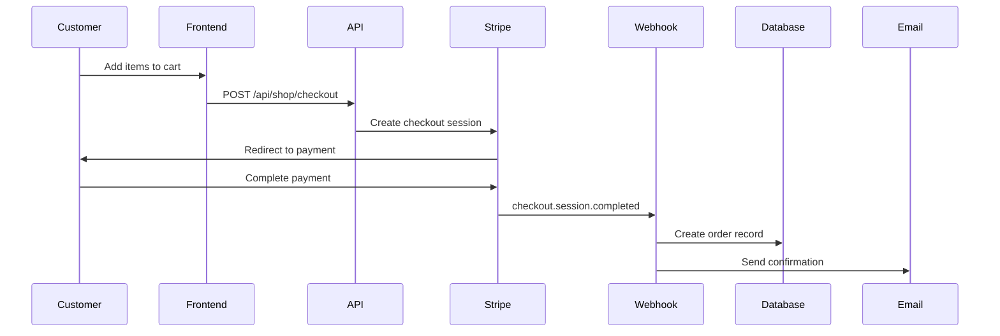

# Spirit Athletics Web Application - Project Overview

## 🏛️ Project Summary

Spirit Athletics is a comprehensive web application designed for a competitive cheerleading gym. The platform combines class booking, private lesson scheduling, coach management, and an e-commerce pop-up shop system into a unified Next.js application.

**Key Features:**
- Public-facing website with program information
- Class and private lesson booking system
- Coach dashboard with availability management
- Pop-up shop with campaign-based merchandise sales
- Admin panel for shop and booking management
- Email notifications and calendar integration

---

## 🏗️ Technical Architecture

### **Technology Stack**

**Frontend:**
- **Next.js 15.3.2** - React framework with App Router
- **React 19.0.0** - Latest React with concurrent features
- **TypeScript 5** - Type safety throughout
- **Tailwind CSS 4** - Utility-first styling
- **Radix UI** - Accessible component primitives

**Backend:**
- **Next.js API Routes** - Serverless API endpoints
- **Prisma 6.14.0** - Database ORM and migrations
- **PostgreSQL** - Primary database (Vercel Postgres)
- **NextAuth.js 4.24.7** - Authentication system

**External Services:**
- **Stripe 18.4.0** - Payment processing for shop
- **Resend 4.0.0** - Transactional email service
- **bcryptjs** - Password hashing

**Development Tools:**
- **ESLint 9** - Code linting
- **Turbopack** - Fast development builds
- **tsx** - TypeScript execution for scripts

### **Project Structure**

```
spiritathletics-web/
├── src/
│   ├── app/                    # Next.js App Router pages
│   │   ├── (dashboard)/        # Protected coach dashboard
│   │   ├── (shop-admin)/       # Shop admin interface
│   │   ├── api/                # API endpoints
│   │   ├── book/               # Booking interface
│   │   ├── shop/               # E-commerce frontend
│   │   └── [public pages]/     # Marketing pages
│   ├── components/             # Shared React components
│   ├── contexts/               # React context providers
│   ├── lib/                    # Utility functions & configs
│   └── types/                  # TypeScript definitions
├── prisma/                     # Database schema & migrations
├── public/                     # Static assets
├── docs/                       # Project documentation
└── scripts/                    # Database seeding scripts
```

---

## 💾 Database Architecture

### **Core Models**

**User Management:**
- `User` - Base user accounts with role-based access (ADMIN, COACH, CUSTOMER)
- `CoachProfile` - Extended coach information with specialties and settings
- `CoachSettings` - Coach preferences and permissions

**Booking System:**
- `Service` - Bookable services (classes or private lessons)
- `ClassTemplate` - Recurring class schedules
- `ClassOccurrence` - Individual class instances
- `Booking` - Customer bookings with cancellation tokens
- `AvailabilityRule` - Coach availability patterns
- `AvailabilityException` - One-off availability changes

**E-commerce (Pop-up Shop):**
- `ShopCampaign` - Time-limited merchandise campaigns
- `ShopProduct` - Products within campaigns
- `ProductSize` - Size variants with pricing deltas
- `ShopOrder` - Customer orders
- `ShopOrderItem` - Individual items within orders

**Audit & Compliance:**
- `AuditLog` - Activity tracking
- `CancellationPolicy` - Booking cancellation rules

### **Key Relationships**

1. **Coach → Services → Bookings**: Coaches offer services that customers book
2. **ClassTemplate → ClassOccurrence → Bookings**: Templates generate occurrences that can be booked
3. **Campaign → Products → Sizes → OrderItems**: Hierarchical product structure
4. **User → CoachProfile → AvailabilityRules**: Coach availability management

---

## 🔐 Authentication & Security

### **Authentication System**
- **NextAuth.js** with credentials provider
- **JWT-based sessions** (24-hour expiry)
- **Role-based access control** (ADMIN, COACH, CUSTOMER)
- **bcrypt password hashing** for coach accounts

### **Security Measures**

**HTTP Security Headers:**
```typescript
// Applied via middleware.ts
X-Frame-Options: DENY
X-Content-Type-Options: nosniff
X-XSS-Protection: 1; mode=block
Strict-Transport-Security: max-age=63072000 (production only)
Content-Security-Policy: [Restrictive policy]
```

**Rate Limiting:**
- **Booking endpoints**: 5 requests/minute per IP+email
- **Cancellation endpoint**: 10 requests/minute per IP
- **In-memory rate limiting** with sliding window

**Input Validation:**
- **Zod schemas** for all API endpoints
- **CUID validation** for database IDs
- **Email normalization** and validation
- **SQL injection prevention** via Prisma ORM

**Additional Security:**
- **Audit logging** for sensitive operations
- **Cancellation token system** (UUID-based)
- **Webhook signature verification** for Stripe
- **Environment variable validation**

---

## 🛒 E-commerce System

### **Pop-up Shop Architecture**

The shop operates on a **campaign-based model**:

1. **Campaigns** have start/end dates and status management
2. **Products** belong to campaigns with base pricing
3. **Sizes** add pricing deltas to base prices
4. **Orders** capture customer purchases with Stripe integration

### **Payment Flow**



### **Key Features**
- **Real-time cart management** with localStorage persistence
- **Campaign time limits** with countdown displays
- **Stripe Checkout integration** for PCI compliance
- **Webhook-based order fulfillment**
- **Email confirmations** with order details
- **Admin order management** with export capabilities

---

## 📅 Booking System

### **Class Booking**
- **Template-based scheduling**: Coaches create recurring class templates
- **Dynamic occurrence generation**: System creates individual class instances
- **Capacity management**: Automatic enrollment limits
- **Real-time availability**: Shows current enrollment vs. capacity

### **Private Lesson Booking**
- **Coach availability rules**: Weekly patterns with time slots
- **Exception handling**: One-off unavailable dates
- **Conflict detection**: Prevents double-booking
- **Multiple duration options**: 30, 45, 60-minute sessions
- **Semi-private lessons**: 2-athlete sessions with per-athlete pricing

### **Booking Features**
- **Automatic email confirmations** with calendar attachments (.ics)
- **Cancellation system** with policy enforcement
- **Coach notifications** with customizable alert emails
- **Timezone handling** (Pacific Time with UTC storage)

---

## 🎨 User Interface

### **Design System**
- **Consistent color scheme**: Blue (#0000FE) and black branding
- **Responsive design**: Mobile-first approach
- **Accessibility**: Proper ARIA labels and keyboard navigation
- **Loading states**: Skeleton screens and spinners
- **Error handling**: User-friendly error messages

### **Key Components**
- **NavBar**: Responsive navigation with mobile menu
- **FloatingCart**: Persistent cart widget
- **BookingDialogs**: Modal-based booking flows
- **AdminDashboards**: Data tables with filtering and sorting
- **FormComponents**: Validated form inputs with error states

### **Page Structure**
- **Marketing pages**: Program information and contact
- **Booking interface**: Class listings and private lesson scheduling
- **Shop frontend**: Product browsing and cart management
- **Coach dashboard**: Availability and booking management
- **Admin panels**: Campaign, product, and order management

---

## 🔧 Configuration & Environment

### **Required Environment Variables**

**Database:**
```env
DATABASE_URL=postgresql://...
```

**Authentication:**
```env
NEXTAUTH_SECRET=<32+ character secret>
NEXTAUTH_URL=https://spiritathletics.net
```

**Email (Resend):**
```env
RESEND_API_KEY=re_...
SENDER_EMAIL=noreply@yourdomain.com
RECEIVABLE_EMAIL=admin@yourdomain.com
```

**Stripe:**
```env
STRIPE_WEBHOOK_SECRET_KEY=whsec_...
SHOP_SUPPORT_EMAIL=support@yourdomain.com

```env - production

STRIPE_SECRET_KEY=sk_live_...
NEXT_PUBLIC_STRIPE_PUBLISHABLE_KEY=pk_live_...

```env - testing ( for Stripe sandbox, purchase testing )
STRIPE_TEST_SECRET_KEY=sk_test_...
NEXT_PUBLIC_STRIPE_PUBLISHABLE_KEY=pk_test_...

```

**Organization:**
```env
ORG_ADDRESS=Spirit Athletics, 17537 Bear Valley Rd, Hesperia, CA 92345
BASE_PROD_URL=https://spiritathletics.net
```

### **Deployment Configuration**

**Build Process:**
```bash
npm run build  # Includes Prisma generation
```

**Database Setup:**
```bash
npx prisma migrate deploy  # Production migrations
npx prisma db seed         # Optional seed data
```

**Recommended Platform:** Vercel (optimized for Next.js)

---

## 📊 Current State Analysis

### ✅ **Strengths**

**Technical Excellence:**
- **Modern stack** with latest Next.js and React versions
- **Type safety** throughout with TypeScript
- **Comprehensive security** measures implemented
- **Well-structured database** schema with proper relationships
- **Professional deployment** documentation

**Feature Completeness:**
- **Full booking system** for both classes and private lessons
- **Complete e-commerce solution** with payment processing
- **Admin interfaces** for all management tasks
- **Email automation** with calendar integration
- **Responsive design** works across devices

**Code Quality:**
- **No linter errors** in codebase
- **Consistent code style** and patterns
- **Proper error handling** throughout
- **Environment validation** prevents misconfigurations
- **Audit logging** for compliance

### ⚠️ **Areas for Improvement**

**Performance Optimization:**
1. **Image optimization**: Consider adding image compression and CDN
2. **Database indexing**: Review query performance for large datasets
3. **Caching strategy**: Implement Redis for session storage and API caching
4. **Bundle optimization**: Code splitting for admin interfaces

**Monitoring & Observability:**
1. **Error tracking**: Integrate Sentry or similar service
2. **Performance monitoring**: Add application performance monitoring
3. **Logging infrastructure**: Centralized logging for production
4. **Health checks**: More comprehensive system health endpoints

**User Experience:**
1. **Progressive Web App**: Add PWA capabilities for mobile users
2. **Offline support**: Cache critical data for offline viewing
3. **Push notifications**: Browser notifications for booking confirmations
4. **Advanced filtering**: Enhanced search and filter options

**Business Features:**
1. **Waiting lists**: Queue system for full classes
2. **Recurring bookings**: Allow customers to book recurring sessions
3. **Payment plans**: Subscription-based payments for ongoing services
4. **Loyalty system**: Points or rewards for frequent customers

### 🚨 **Potential Issues**

**Minor Technical Debt:**
1. **Debug logging**: Remove development console.log statements before production
2. **Rate limiting**: In-memory store won't scale across multiple instances
3. **Email templates**: Consider moving to external template service
4. **Image hosting**: Multiple image hosting services configured (consolidate)

**Security Considerations:**
1. **Session storage**: Consider Redis for distributed sessions
2. **API rate limiting**: Implement distributed rate limiting
3. **Input sanitization**: Add additional XSS protection for user content
4. **Dependency updates**: Regular security updates for dependencies

**Scalability Concerns:**
1. **Database connections**: Connection pooling for high traffic
2. **File storage**: Move to cloud storage for uploaded images
3. **Email sending**: Rate limiting for email services
4. **Background jobs**: Queue system for heavy operations

---

## 🎯 Recommendations

### **Immediate Actions (Next 30 Days)**
1. **Production deployment**: Follow the comprehensive deployment guide
2. **Monitoring setup**: Implement basic error tracking and uptime monitoring
3. **Security audit**: Review and test all authentication flows
4. **Performance testing**: Load test booking and checkout systems

### **Short-term Improvements (1-3 Months)**
1. **Image optimization**: Implement Next.js Image optimization fully
2. **Advanced monitoring**: Add application performance monitoring
3. **Email templates**: Migrate to professional email template service
4. **Mobile app**: Consider PWA implementation

### **Long-term Enhancements (3-12 Months)**
1. **Advanced features**: Waiting lists, recurring bookings, payment plans
2. **Analytics integration**: Customer behavior tracking and reporting
3. **Third-party integrations**: Calendar sync, SMS notifications
4. **Scalability improvements**: Microservices architecture consideration

---

## 🏆 Conclusion

The Spirit Athletics web application is a **professionally built, feature-complete platform** that effectively serves the needs of a competitive cheerleading gym. The codebase demonstrates excellent technical practices, comprehensive security measures, and thoughtful user experience design.

**Key Highlights:**
- **Production-ready** codebase with no critical issues
- **Comprehensive feature set** covering all business requirements
- **Excellent documentation** for deployment and maintenance
- **Strong security posture** with proper authentication and data protection
- **Scalable architecture** that can grow with the business

The application successfully combines multiple complex systems (booking, e-commerce, user management) into a cohesive platform while maintaining code quality and user experience standards. With proper deployment and monitoring, this system is ready to serve Spirit Athletics' customers and staff effectively.

---

## 📚 Additional Resources

- **[Production Deployment Guide](docs/PRODUCTION_DEPLOYMENT.md)** - Comprehensive deployment checklist
- **[Stripe Setup Guide](docs/STRIPE_SETUP.md)** - Payment system configuration
- **[Database Schema](prisma/schema.prisma)** - Complete data model
- **[Environment Template](env.example)** - Configuration reference

---

*Last Updated: January 2025*
*Version: 1.0.0*
